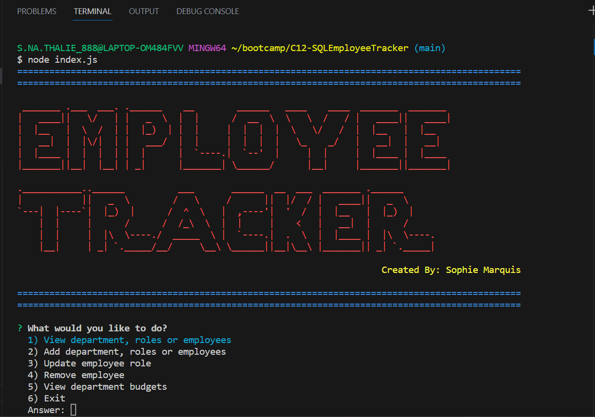
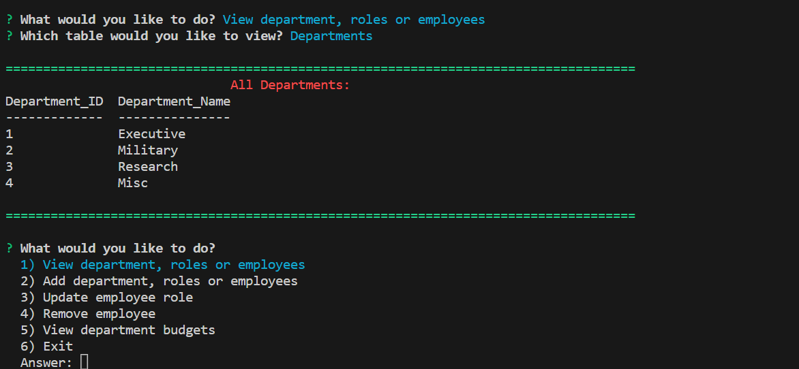
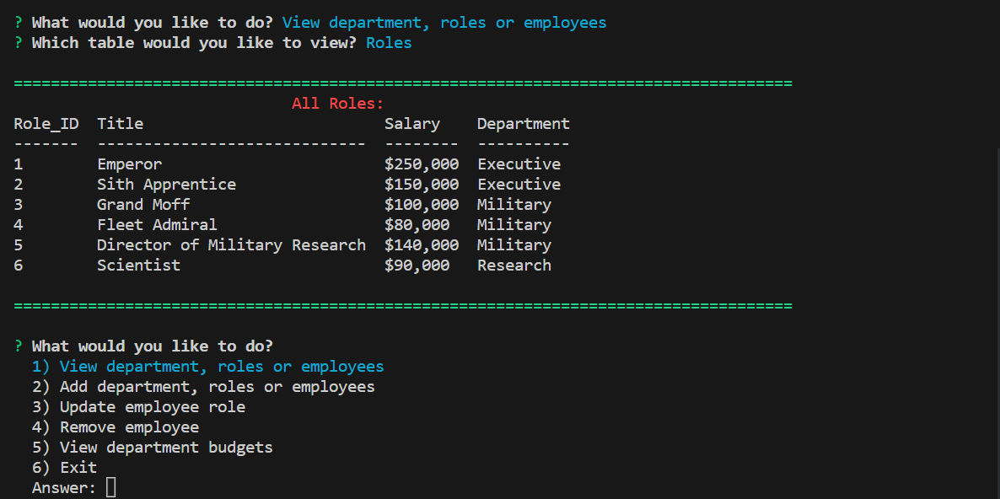
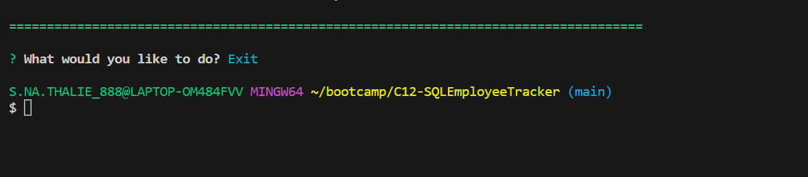

# C12-SQLEmployeeTracker
Challenge 12 - Boot Camp

[](https://opensource.org/licenses/MIT)


## Table of Contents

  1. [Description of Assignment](#description-of-assignment)
  2. [About](#about)
      1. [User Story](#user-story)
      2. [Acceptance criteria](#acceptance-criteria)
  3. [Screenshots](#screenshots)    
  3. [Walkthrough Videos](#walkthrough-videos)
  4. [License](#license)
  5. [Contact](#contact)
  6. [Final Work Review](#final-work-review)


  ## Description of Assignment

Developers frequently have to create interfaces that allow non-developers to easily view and interact with information stored in databases. These interfaces are called content management systems (CMS). Your assignment this week is to build a command-line application from scratch to manage a company's employee database, using Node.js, Inquirer, and MySQL.

  ## About 

---
### User Story

```
AS A business owner
I WANT to be able to view and manage the departments, roles, and employees in my company
SO THAT I can organize and plan my business

```
### Acceptance Criteria

```
GIVEN a command-line application that accepts user input
WHEN I start the application
THEN I am presented with the following options: view all departments, view all roles, view all employees, add a department, add a role, add an employee, and update an employee role
WHEN I choose to view all departments
THEN I am presented with a formatted table showing department names and department ids
WHEN I choose to view all roles
THEN I am presented with the job title, role id, the department that role belongs to, and the salary for that role
WHEN I choose to view all employees
THEN I am presented with a formatted table showing employee data, including employee ids, first names, last names, job titles, departments, salaries, and managers that the employees report to
WHEN I choose to add a department
THEN I am prompted to enter the name of the department and that department is added to the database
WHEN I choose to add a role
THEN I am prompted to enter the name, salary, and department for the role and that role is added to the database
WHEN I choose to add an employee
THEN I am prompted to enter the employee’s first name, last name, role, and manager, and that employee is added to the database
WHEN I choose to update an employee role
THEN I am prompted to select an employee to update and their new role and this information is updated in the database
```

## Screenshots









## Walkthrough Videos

https://drive.google.com/file/d/1JykXZG6BHhkz2lh9F6i69dVe8Eh3cqYC

https://drive.google.com/file/d/1RIqGLK8JrAVD-F7C_hx14PU4ck5taqw0

## License

License used for this project - MIT
  * For more information on license types, please reference this website
  for additional licensing information: [https: //choosealicense.com/](https://choosealicense.com/).


  ## Contact

  * GitHub Username: [SMarquis85](https://github.com/SMarquis85)
  * Email: sophienathalie_85@outlook.com


  ## Final Work Review

**"Always leave the code a little cleaner than when you found it."**  This action was applied to ALL JAVASCRIPT files. To create this assignment, I used Lawrence Wilson's Audiobook, Cathy Tanimura's book on SQL. References we're found on Google, multiple websites including W3Schools, DEV, GitHub, Insomnia and Tutorialspoint. YouTube was helpful as well as all ZOOM recordings (of previous classes). Looks much cleaner, organised and easier to find what you are looking for. I also received the help of my second tutor, Erik Hoversten. He helped clean up my code and fix multiple errors I have encountered while building this database.

> **(CARL-VIRT-FSF-PT-04-2023, Challenge 11 / README.md 2023)**

> **(JavaScript Full Stack Developers, Lawrence Wilson; Audiobook (2023) 6hrs and 29mins. )**

> **(SQL for Data Analysis: Advanced Techniques for Transforming Data into Insights, Cathy Tanimura; 1st edition (Oct. 19th 2021) 357 pages.)** 


## Github Repository Link:

